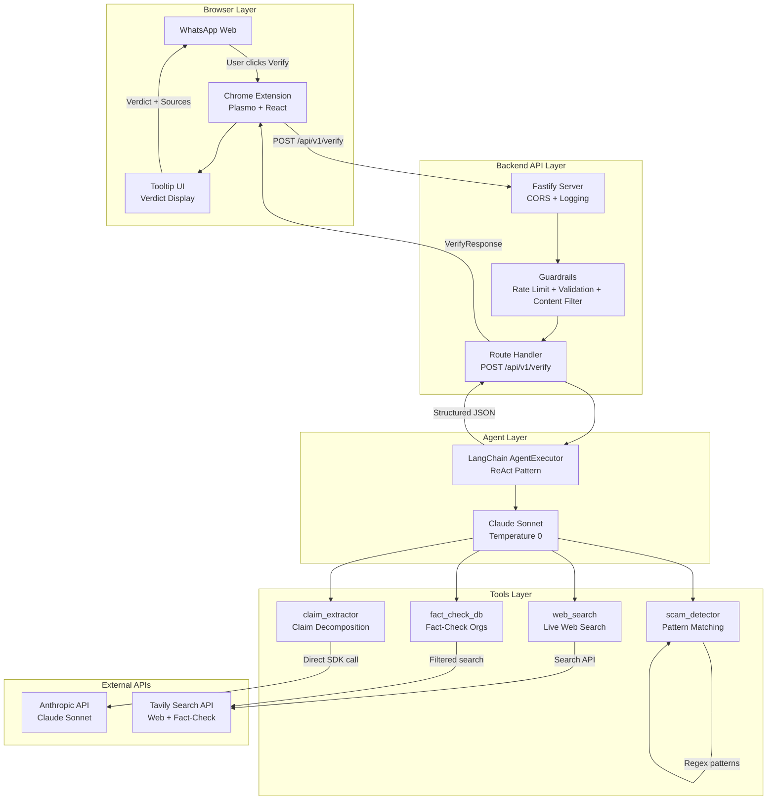

# ForwardGuard

**AI-powered misinformation verification for WhatsApp Web**

Misinformation spreads faster than ever through private messaging. WhatsApp forwards reach millions before anyone checks if they're true. ForwardGuard tackles this by embedding an AI fact-checking agent directly into WhatsApp Web — users click a "Verify" button next to any message and get an instant, sourced verdict.

This is not a simple chatbot or RAG pipeline. ForwardGuard is a **tool-using AI agent** that follows the ReAct (Reason + Act) pattern: it decomposes claims, searches the live web, queries fact-checking databases, detects scam patterns, and synthesizes evidence into a structured verdict — all with full observability and guardrails.

## Architecture



## How It Works — The Agent Reasoning Loop

1. **User clicks "Verify"** on any WhatsApp message
2. The extension sends the message text to the backend
3. **Input guardrails** validate and sanitize the request
4. The **AI agent** begins its ReAct loop:
   - **Think**: What claims does this message make?
   - **Act**: Call `claim_extractor` to decompose the message
   - **Think**: What does the web say about each claim?
   - **Act**: Call `web_search` for current sources
   - **Act**: Call `fact_check_db` for dedicated fact-checker verdicts
   - **Think**: Are there scam patterns?
   - **Act**: Call `scam_detector` if suspicious signals found
   - **Synthesize**: Weigh all evidence and produce a verdict
5. **Output guardrails** validate the response
6. The tooltip displays: verdict, confidence, explanation, sources, and tools used

## Tech Stack

| Technology | Why |
|---|---|
| **Fastify** | Faster than Express, better TypeScript support, built-in Pino logging |
| **TypeScript (strict)** | Type safety across the entire codebase |
| **LangChain** | Agent orchestration with tool calling, intermediate step logging |
| **Claude Sonnet** | Best-in-class tool calling, structured JSON output, fast |
| **Tavily** | Purpose-built for LLM agents, clean snippets, answer synthesis |
| **Pino** | Structured JSON logging with requestId correlation |
| **Zod** | Runtime input validation with type inference |
| **Plasmo** | Modern Chrome extension framework with React + hot reload |

## Project Structure

```
forwardguard/
├── README.md
├── docs/
│   ├── architecture.md          # System architecture (Mermaid)
│   ├── sequence-diagram.md      # Request lifecycle (Mermaid)
│   ├── agent-flow.md            # Agent reasoning flow (Mermaid)
│   ├── requirements.md          # Feature checklist tracker
│   └── api-spec.md              # API contract documentation
├── backend/
│   ├── src/
│   │   ├── index.ts             # Fastify server entry point
│   │   ├── types/
│   │   │   └── index.ts         # All shared TypeScript types
│   │   ├── middleware/
│   │   │   ├── logger.ts        # Pino structured logger
│   │   │   └── guardrails.ts    # Input/output guardrails + rate limit
│   │   ├── agent/
│   │   │   ├── agent.ts         # LangChain AgentExecutor
│   │   │   ├── prompts.ts       # All LLM prompts (versioned)
│   │   │   └── tools/
│   │   │       ├── claimExtractor.ts
│   │   │       ├── webSearch.ts
│   │   │       ├── factCheck.ts
│   │   │       └── scamDetector.ts
│   │   └── routes/
│   │       └── verify.ts        # POST /api/v1/verify handler
│   ├── package.json
│   ├── tsconfig.json
│   ├── .env.example
│   └── .gitignore
└── extension/
    ├── src/
    │   ├── content/
    │   │   ├── index.tsx         # Content script (WhatsApp injection)
    │   │   └── TooltipUI.tsx     # Verdict tooltip component
    │   └── api/
    │       └── verify.ts         # HTTP client for backend
    ├── package.json
    ├── tsconfig.json
    └── .env.example
```

## Setup Instructions

### Prerequisites

- Node.js 18+ and npm
- An [Anthropic API key](https://console.anthropic.com)
- A [Tavily API key](https://tavily.com) (free tier works)
- Google Chrome browser

### 1. Clone and Install

```bash
# Install backend dependencies
cd backend && npm install

# Install extension dependencies
cd ../extension && npm install
```

### 2. Configure API Keys

```bash
# Backend
cp backend/.env.example backend/.env
# Edit backend/.env and add your ANTHROPIC_API_KEY and TAVILY_API_KEY
```

### 3. Run the Backend

```bash
cd backend
npm run dev
```

The server starts on `http://localhost:3001`. You should see:
```
ForwardGuard backend listening on http://0.0.0.0:3001
```

### 4. Load the Extension in Chrome

```bash
cd extension
npm run dev
```

1. Open Chrome → `chrome://extensions/`
2. Enable "Developer mode" (top right)
3. Click "Load unpacked"
4. Select the `extension/build/chrome-mv3-dev` folder
5. Open [WhatsApp Web](https://web.whatsapp.com)
6. You'll see "Verify" buttons next to messages

### 5. Test with curl

```bash
# Health check
curl http://localhost:3001/api/v1/health

# Verify a message
curl -X POST http://localhost:3001/api/v1/verify \
  -H "Content-Type: application/json" \
  -d '{"message": "NASA confirms Earth will experience 15 days of darkness in November 2024"}'
```

## Usage

1. Open [WhatsApp Web](https://web.whatsapp.com) in Chrome
2. Find any forwarded message or suspicious claim
3. Click the blue **Verify** button next to the message
4. Wait a few seconds while the AI agent investigates
5. Read the verdict tooltip showing: verdict, confidence, explanation, sources, and tools used

## The 4 Verification Tools

### 1. Claim Extractor
Decomposes a multi-claim message into individual verifiable assertions using Claude Sonnet. This makes all downstream tool calls precise — each claim is checked independently.

### 2. Web Search
Searches the live web via Tavily for current, credible sources about each claim. Scores domain credibility (high/medium/low) and excludes known misinformation sites.

### 3. Fact-Check Database
Queries dedicated fact-checking organizations (Snopes, PolitiFact, FactCheck.org, Reuters, AP News, etc.) specifically. Every result from this tool is inherently high-credibility, with much better signal-to-noise for debunked viral claims.

### 4. Scam Detector
Uses deterministic regex patterns (not LLM) to detect manipulation tactics: urgency pressure, chain letters, financial threats, prize scams, phishing links, health misinformation, false authority claims, and religious manipulation. Deterministic by design — never hallucinates, fully auditable.

## Sample Verdict Output

```json
{
  "requestId": "a1b2c3d4-e5f6-7890-abcd-ef1234567890",
  "verdict": "FALSE",
  "confidence": 0.95,
  "explanation": "This claim about 15 days of darkness has been repeatedly debunked since 2015. NASA has never made such an announcement. Multiple fact-checking organizations have confirmed this is a recurring hoax.",
  "claims": [
    {
      "id": "c1",
      "text": "NASA confirms Earth will experience 15 days of darkness",
      "type": "factual"
    }
  ],
  "sources": [
    {
      "title": "No, NASA Did Not Predict 15 Days of Darkness",
      "url": "https://www.snopes.com/fact-check/15-days-of-darkness/",
      "snippet": "This claim has been circulating since 2015 and has been repeatedly debunked...",
      "credibility": "high"
    }
  ],
  "toolsUsed": ["claim_extractor", "web_search", "fact_check_db"],
  "reasoning": "Step 1: Extracted one factual claim about NASA and darkness. Step 2: Web search found no credible sources confirming this claim. Step 3: Fact-check databases from Snopes and AFP confirm this is a debunked hoax originating from 2015.",
  "processingTimeMs": 4523,
  "timestamp": "2024-11-15T10:30:00.000Z"
}
```

## Known Limitations

- **No persistent storage** — results are not cached; designed for stateless deployment
- **Rate limiting is in-memory** — resets on server restart; production would use Redis
- **WhatsApp DOM selectors may change** — WhatsApp Web updates could break the content script; selectors are documented and easy to update
- **No authentication** — anyone who can reach the backend can use it; production would add auth
- **English-optimized** — claim extraction and fact-checking work best for English content
- **Tavily free tier limits** — heavy usage may hit API rate limits
- **Agent response time** — complex claims with multiple tools may take 5-15 seconds

## Future Improvements

- **Response caching** — cache results by message hash to avoid re-checking identical forwards
- **Multi-language support** — translate claims before fact-checking
- **Confidence calibration** — track accuracy over time and calibrate confidence scores
- **Redis rate limiting** — distributed rate limiting for production
- **WebSocket streaming** — stream agent reasoning steps in real-time to the tooltip
- **Image/video analysis** — extend to verify claims in media, not just text
- **User feedback loop** — let users report incorrect verdicts to improve accuracy
- **Batch verification** — check all visible messages at once
