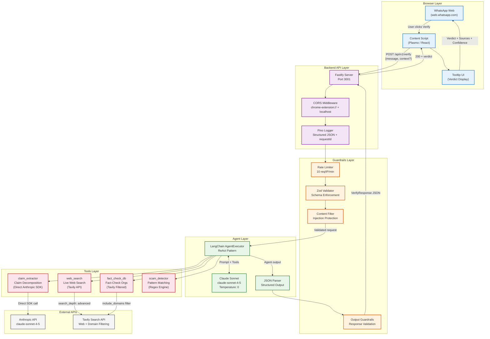

# ForwardGuard — System Architecture

## Overview

ForwardGuard is a layered system that connects a Chrome extension (injected into WhatsApp Web) to an AI-powered verification backend. Each layer has a single responsibility, making the system testable, observable, and maintainable.

## Architecture Diagram

## Layer Descriptions

### Browser Layer
The Chrome extension (built with Plasmo) injects into WhatsApp Web's DOM. A MutationObserver watches for new messages and adds "Verify" buttons. When clicked, the extension calls the backend API and renders a tooltip with the verdict.

### Backend API Layer
Fastify handles HTTP with built-in Pino logging. Every request gets a UUID (`requestId`) that flows through all log lines for end-to-end tracing. CORS is locked to extension and localhost origins only.

### Guardrails Layer
Defence-in-depth: rate limiting prevents abuse, Zod validates input shape, content filters block prompt injection attempts. On the output side, we validate the agent's response before returning it to the user — never exposing raw LLM output.

### Agent Layer
LangChain's AgentExecutor implements the ReAct pattern: the agent reasons about what tool to call next, observes the result, and loops until it has enough evidence. Claude Sonnet at temperature 0 ensures deterministic, reproducible verdicts.

### Tools Layer
Four specialized tools, each with a single responsibility:
- **claim_extractor**: Uses a direct Anthropic SDK call (not LangChain) for precise claim decomposition
- **web_search**: Tavily advanced search with credibility scoring
- **fact_check_db**: Tavily filtered to trusted fact-checking domains only
- **scam_detector**: Deterministic regex patterns — no LLM hallucination risk

### External APIs
- **Anthropic**: Powers both the agent LLM and the claim extractor
- **Tavily**: Purpose-built search API for LLM agents with clean snippet extraction
