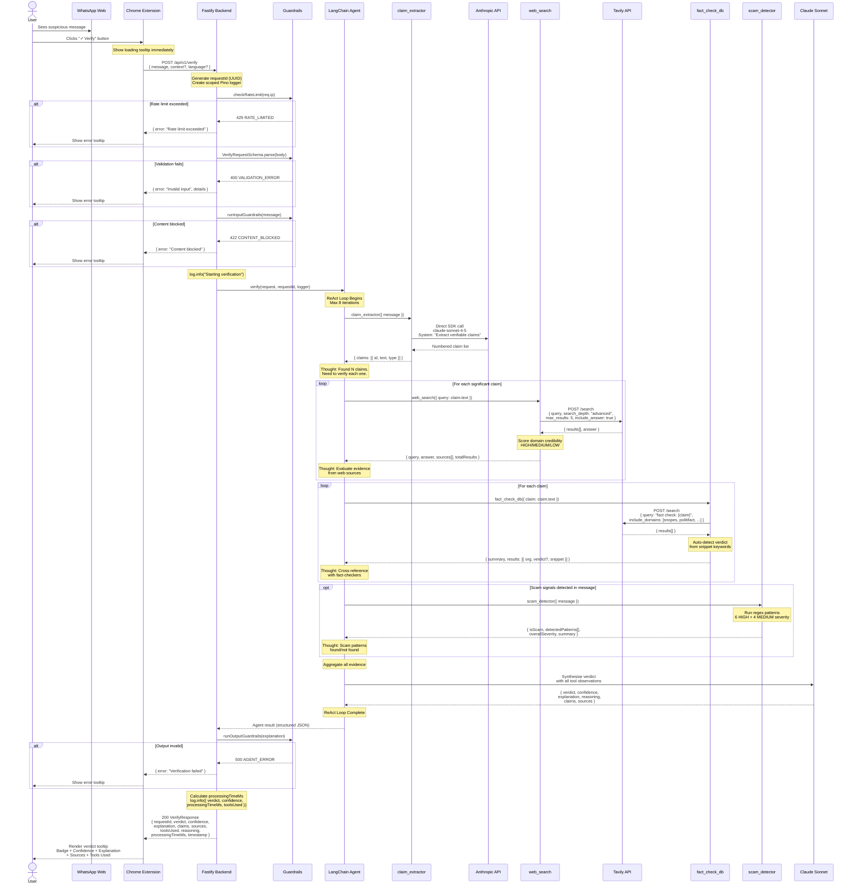

# ForwardGuard — Request Lifecycle

## Full Sequence Diagram

## Data Shapes at Each Step

| Step | Data Shape |
|------|-----------|
| Extension → Backend | `{ message: string, context?: string, language?: string }` |
| Claim Extractor → Agent | `{ claims: [{ id: "c1", text: string, type: "factual"\|"statistical"\|... }] }` |
| Web Search → Agent | `{ query: string, answer: string, sources: [{ title, url, snippet, credibility }], totalResults: number }` |
| Fact Check → Agent | `{ summary: string, results: [{ organization, title, url, verdict?, snippet }] }` |
| Scam Detector → Agent | `{ isScam: boolean, detectedPatterns: [{ pattern, severity, description }], overallSeverity: string, summary: string }` |
| Backend → Extension | `{ requestId, verdict, confidence, explanation, claims[], sources[], toolsUsed[], reasoning, processingTimeMs, timestamp }` |

## Timing Expectations

| Phase | Expected Duration |
|-------|------------------|
| Input guardrails | < 5ms |
| Claim extraction | 1-2s |
| Web search (per claim) | 1-3s |
| Fact-check lookup (per claim) | 1-2s |
| Scam detection | < 1ms |
| Agent synthesis | 1-2s |
| Output guardrails | < 1ms |
| **Total (typical)** | **5-12s** |
